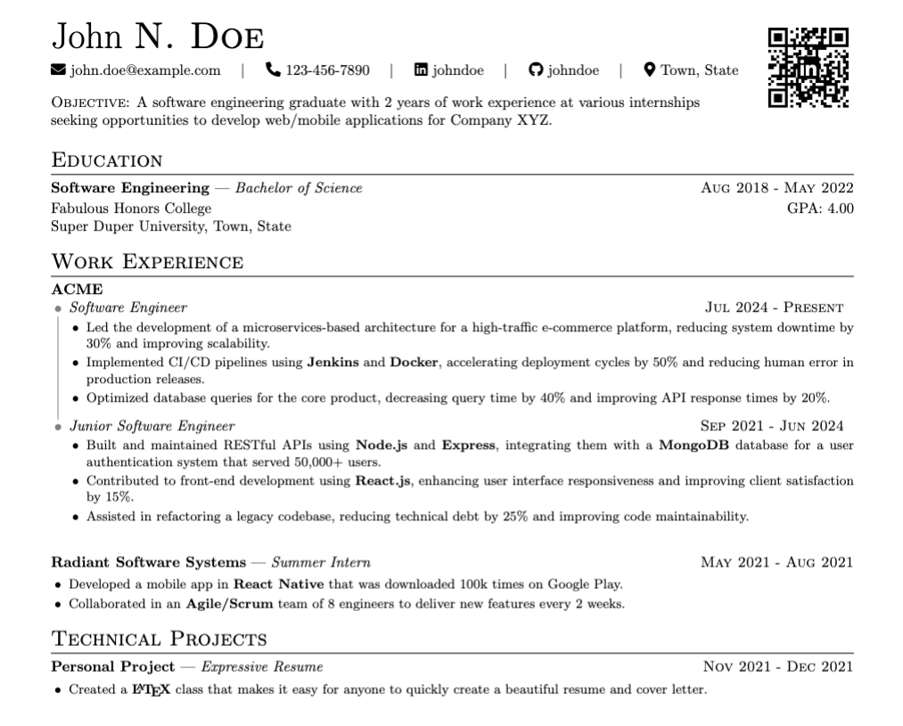
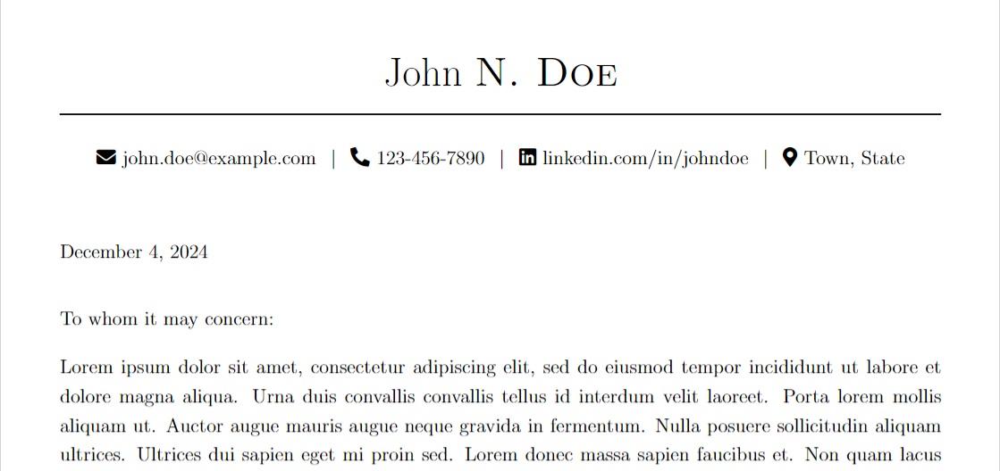

<div align="center">

# Expressive Resume

A beautiful resume/cover letter LaTeX template pair that are extraordinarily
easy to use.

<!-- BADGES -->
[](https://github.com/thehale/expressive-resume/blob/master/LICENSE)
[](https://github.com/sponsors/thehale)
[](https://twitter.com/intent/user?screen_name=jhaledev)


</div>


**Why Expressive Resume??**

 - **Declarative:** Use semantically meaningful commands like `\experience` and
   `\achievement` instead of worrying about LaTeX plumbing.
 - **Cover Letter:** Expressive includes both a resume template *and* a matching
   cover letter template.
 - **Machine/ATS Friendly:** Expressive Resume was designed by an engineer with
   experience building automated resume parsers for [Applicant Tracking Systems](https://www.indeed.com/hire/c/info/what-is-ats#:~:text=when%20the%20ats%20parses%20a%20resume%20and%20determines%20it%20meets%20your%20requirements%2C%20it%20automatically%20moves%20that%20applicant%20forward%20in%20the%20hiring%20process.)
 - **Maintainability:** Most LaTeX resume/cover letter templates start with 100-200
   lines of formatting code (or more). With Expressive Resume, you simply specify
   the `documentclass` and begin writing!
 - **Compatibility:** Expressive Resume is written in LaTeX2e, so it is compatible
   with most LaTeX typesetting engines.

## Quickstart

The recommended way to use Expressive Resume is via the included "VS Code
devcontainer" which has LaTeX pre-installed in an sandboxed environment
compatible with Windows, Linux, and MacOS.

If you already have LaTeX installed, you can clone the repository and skip
straight to [Create Your Expressive Resume](#create-your-expressive-resume).
### Installation + Setup

Start by making sure [Docker](https://docs.docker.com/get-docker/) and [VS
Code](https://code.visualstudio.com/) (including the [Remote Containers
Extension](https://marketplace.visualstudio.com/items?itemName=ms-vscode-remote.remote-containers))
are installed on your machine.

Then create a copy of Expressive Resume and open it in VS Code:
1. Press the [Use this
   template](https://github.com/jhale1805/expressive-resume/generate) button
   **OR** [create a fork](https://github.com/jhale1805/expressive-resume/fork).
2. Clone your copy of Expressive Resume onto your computer and open it in VS
   Code.
```bash
git clone https://github.com/YOUR_GITHUB_USERNAME/expressive-resume.git
cd expressive-resume
code .
```

VS Code should prompt you to **Reopen in Container**. Accept that prompt.
- If you don't see this pop-up, go to `View -> Command Palette ->
  Remote-Containers: Re-Open Folder in Container`

- Note that opening Expressive Resume for the first time may take several
  minutes as it downloads and prepares the 4 GB sandboxed LaTeX installation.
  Successive launches will be much faster.

### Create Your Expressive Resume

Create an empty `.tex` file in the `src` folder alongside the `.cls` files.

Use a `documentclass` of `ExpressiveResume`
```tex
\documentclass{ExpressiveResume}

\begin{document}

% You will write your resume here.

\end{document}
```

Create your resume header with the `resumeheader` command (all parameters are
optional).

```tex
\resumeheader[
    firstname=,             % Your first name
    middleinitial=,         % Your middle initial
    lastname=,              % Your last name
    email=,                 % Your email
    phone=,                 % Your phone number, formatted as XXX-XXX-XXXX
    linkedin=,              % Your LinkedIn handle (without the @)
    github=,                % Your GitHub handle (without the @)
    city=,                  % Your city of residence (ignored if no `state` is given)
    state=,                 % Your state of residence
    qrcode=,                % the path to a qr code to show in the top right corner
    fixobjectivespacing=    % Recommended when using both a qrcode and an `objective`
]
```

If you want a summary/objective statement in your resume, that's easy to add.

```tex
\objective{
    % Write your objective statement here.
}
```

Adding experiences and achievements is also straightforward.
```tex
\experience{Position}{Organization}{Start Date}{End Date}{
    \achievement{
        % Describe your achievement here
    }
    \achievement{
        % Describe another achievement here.
    }
}
```

You can also easily add inline highlights for the technologies and skills
relevant to the job position you are applying for.

```tex
\tech{
    % Name your familiar technology or skill
}
```

And that's it! Take a look at the [resume example](#example-expressive-resume)
to see just how cleanly all of these pieces work together in a simple, readable
`.tex` file to produce a beautiful resume.

### Create Your Expressive Cover Letter

Create an empty `.tex` file in the `src` folder alongside the `.cls` files.

Use a `documentclass` of `ExpressiveCoverLetter`
```tex
\documentclass{ExpressiveCoverLetter}

\begin{document}

% You will write your cover letter here.

\end{document}
```

Create your cover letter header with the `coverletterheader` command (all
parameters are optional).

```tex
\coverletterheader[
    firstname=,             % Your first name
    middleinitial=,         % Your middle initial
    lastname=,              % Your last name
    email=,                 % Your email
    phone=,                 % Your phone number, formatted as XXX-XXX-XXXX
    linkedin=,              % Your LinkedIn handle (without the @)
    github=,                % Your GitHub handle (without the @)
    city=,                  % Your city of residence (ignored if no `state` is given)
    state=,                 % Your state of residence
]
```

From there, just write out the text of your cover letter, using a blank line
between paragraphs.

You can also easily add inline highlights for the technologies and skills
relevant to the job position you are applying for.

```tex
\tech{
    % Name your familiar technology or skill
}
```

And that's it! Take a look at the [cover letter
example](#example-expressive-cover-letter) to see just how cleanly all of these
pieces work together in a simple, readable `.tex` file to produce a beautiful
cover letter.

## Examples
### Example Expressive Resume


```tex
\documentclass{ExpressiveResume}

% ----- Resume -----
\begin{document}

% ----- Name + Contact Information -----
\resumeheader[
    firstname=John,
    middleinitial=N,
    lastname=Doe,
    email=john.doe@example.com,
    phone=123-456-7890,
    github=johndoe,
    city=Town,
    state=State,
    qrcode=./images/qr.png,
    fixobjectivespacing=true
]

\objective{A software engineering graduate with 2 years of work
experience at various internships \\ seeking opportunities to develop
web/mobile applications for Company XYZ.}

% ----- Education -----
\section{Education}
\experience{Bachelor of Science}{Software Engineering}{Aug 2018}{May 2022}{
    \noindent Fabulous Honors College \hfill GPA: 4.00 \newline
    Super Duper University, Town, State \newline
}

% ----- Work Experience -----
\section{Work Experience}
\experience{Summer Intern}{Radiant Software Systems}{Aug 2021}{May 2021}{
    \achievement{
        Developed a mobile app in \tech{React Native} that was
        downloaded 100k times on Google Play.
    }
    \achievement{
        Collaborated in an \tech{Agile/Scrum} team of 8 engineers to
        deliver new features every 2 weeks.
    }
}

% ----- Technical Projects -----
\section{Technical Projects}
\experience{Expressive Resume}{Personal Project}{Nov 2021}{Dec 2021}{
    \achievement{
        Created a \tech{\LaTeX} class that makes it easy for anyone to
        quickly create a beautiful resume and cover letter.
    }
}

\end{document}
```

### Example Expressive Cover Letter


```tex
\documentclass{ExpressiveCoverLetter}

\begin{document}

\coverletterheader[
    firstname=John,
    middleinitial=N,
    lastname=Doe,
    email=john.doe@example.com,
    phone=123-456-7890,
    github=johndoe,
    city=Town,
    state=State
]

\vspace{0.25in}
\today
\vspace{0.15in}


To whom it may concern:

Lorem ipsum dolor sit amet ...

Sincerely,

\vspace{.15in}

John Doe

\end{document}
```
